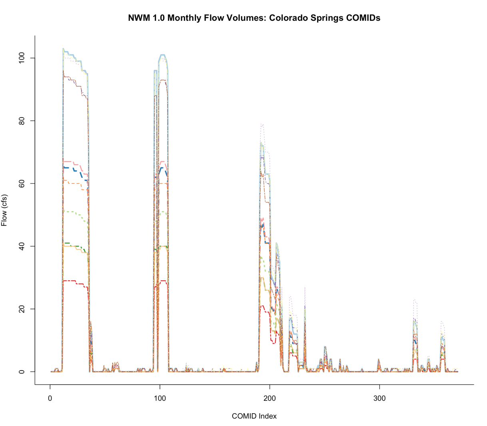

# nwmRetro

This package is part of a working paper that compiles estimate flow volumes from the NWM retrospective v1.0 run at the NHD reach level. This package contains functionalites for  getting NHD subsets from the USGS WCS, joining the nwmRetro stats to that file, and writing it to disk in a number of formats. 

Future work will look at updating this dataset to the NWM retrospective v1.2 as well as including veleocity estimates.

## Basic Starting example

```r
system.time({
obj = AOI::getAOI("Colorado Springs") %>% 
  find() %>% 
  join() %>% 
  write(file = './nwmRetro_grandCanyon.gpkg')
})

user  system    elapsed 
1.009   0.153   3.670  

```

```r

names(obj)

[1] "comid"        "id"           "ogc_fid"      "fdate"        "resolution"   "gnis_id"     
[7] "gnis_name"    "lengthkm"     "reachcode"    "flowdir"      "wbareacomi"   "ftype"       
[13] "fcode"        "streamleve"   "streamorde"   "streamcalc"   "fromnode"     "tonode"      
[19] "hydroseq"     "levelpathi"   "pathlength"   "terminalpa"   "arbolatesu"   "divergence"  
[25] "startflag"    "terminalfl"   "dnlevel"      "uplevelpat"   "uphydroseq"   "dnlevelpat"  
[31] "dnminorhyd"   "dndraincou"   "dnhydroseq"   "frommeas"     "tomeas"       "rtndiv"      
[37] "vpuin"        "vpuout"       "areasqkm"     "totdasqkm"    "divdasqkm"    "hwnodesqkm"  
[43] "maxelevraw"   "minelevraw"   "maxelevsmo"   "minelevsmo"   "slope"        "elevfixed"   
[49] "hwtype"       "slopelenkm"   "q0001a"       "v0001a"       "qincr0001a"   "q0001b"      
[55] "v0001b"       "qincr0001b"   "q0001c"       "v0001c"       "qincr0001c"   "q0001d"      
[61] "v0001d"       "qincr0001d"   "q0001e"       "v0001e"       "qincr0001e"   "q0001f"      
[67] "qincr0001f"   "arq0001nav"   "temp0001"     "ppt0001"      "pet0001"      "qloss0001"   
[73] "qg0001adj"    "qg0001nav"    "lat"          "gageadj"      "avgqadj"      "smgageid"    
[79] "smgageq"      "etfract1"     "etfract2"     "a"            "b"            "bcf"         
[85] "r2"           "ser"          "nref"         "gageseqp"     "gageseq"      "shape_length"
[91] "rpuid"        "Jan"          "Feb"          "Mar"          "Apr"          "May"         
[97] "Jun"          "Jul"          "Aug"          "Sep"          "Oct"          "Nov"         
[103] "Dec"          "tz_index"     "annual"       "fall"         "spring"       "summer"      
[109] "winter"       "geometry"    

```

<br>

<br>

<br>

<br>

<br>

<br>


To Do:

- [X]  Add data files
- [X] Create a join function that attacahes data files to 'find' files before writing
